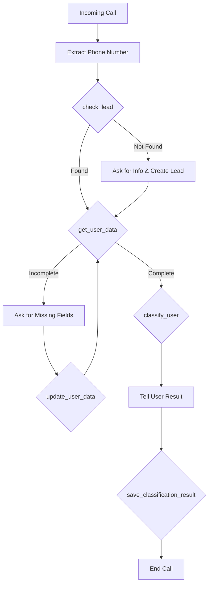

# VAPI Voice Agent with Mock CRM Integration

A comprehensive voice agent system built with VAPI that integrates with mock CRM servers and VICI dialer to handle inbound calls, verify Medicare eligibility, and classify members for premium eyewear subscription.

## 🏗️ Architecture

The system consists of 5 main components:

1. **Lead CRM Server** (Port 3001) - Manages lead information and phone number lookup
2. **User Data CRM Server** (Port 3002) - Stores and updates Medicare member data
3. **Classification CRM Server** (Port 3003) - Classifies users as QUALIFIED/NOT_QUALIFIED for premium eyewear
4. **VICI Mock Server** (Port 3004) - Simulates VICI dialer for call dispositions and callbacks
5. **VAPI Tool Handler** (Port 3000) - Webhook endpoint for VAPI tool calls

## 📁 Project Structure

```
homework2/
├── src/
│   ├── config/
│   │   ├── logger.ts              # Pino logger configuration
│   │   └── constants.ts           # Application constants
│   ├── types/
│   │   ├── lead.types.ts          # Lead type definitions
│   │   ├── userData.types.ts      # User data type definitions
│   │   ├── classification.types.ts # Classification type definitions
│   │   └── vapi.types.ts          # VAPI webhook type definitions
│   ├── utils/
│   │   └── phoneNumber.util.ts    # Phone number utilities
│   ├── data/
│   │   ├── leads.data.ts          # Mock lead data
│   │   ├── userData.data.ts       # Mock user data
│   │   └── classifications.data.ts # Classification storage
│   ├── services/
│   │   └── vapi.service.ts        # CRM API service layer
│   ├── mock-servers/
│   │   ├── leadCrm.server.ts      # Lead CRM API
│   │   ├── userDataCrm.server.ts  # User Data CRM API
│   │   └── classificationCrm.server.ts # Classification CRM API
│   └── vapi/
│       └── toolHandler.server.ts  # VAPI webhook handler
├── .env.example                    # Environment variables template
├── package.json
├── tsconfig.json
└── README.md
```

## 🚀 Quick Start

### Prerequisites

- Node.js (v18 or higher)
- npm or yarn
- VAPI account (get one at https://vapi.ai)

### Installation

1. **Clone and navigate to the project:**
   ```bash
   cd homework2
   ```

2. **Install dependencies:**
   ```bash
   npm install
   ```

3. **Set up environment variables:**
   ```bash
   # Copy the example env file
   cp .env.example .env

   # Edit .env and add your VAPI token
   # Get your token from https://dashboard.vapi.ai
   ```

4. **Run all servers:**
   ```bash
   npm run dev:all
   ```

   This will start all 5 servers concurrently:
   - VAPI Tool Handler: http://localhost:3000
   - Lead CRM: http://localhost:3001
   - User Data CRM: http://localhost:3002
   - Classification CRM: http://localhost:3003
   - VICI Mock Server: http://localhost:3004

### Running Individual Servers

You can also run servers individually for testing:

```bash
npm run dev:lead-crm           # Lead CRM only
npm run dev:userdata-crm       # User Data CRM only
npm run dev:classification-crm # Classification CRM only
npm run dev:vici               # VICI Mock Server only
npm run dev:vapi-handler       # VAPI handler only
```

## 🔧 VAPI Configuration

### Step 1: Expose Your Local Server (Development)

For local testing, you need to expose your local server to the internet using ngrok or similar:

```bash
# Install ngrok if you haven't
npm install -g ngrok

# Expose port 3000
ngrok http 3000
```

Copy the HTTPS URL (e.g., `https://abc123.ngrok.io`)

### Step 2: Get Tool Definitions

Visit http://localhost:3000/api/vapi/tools to see the complete tool definitions for VAPI.

### Step 3: Configure VAPI Assistant

1. **Create a new Assistant** in the VAPI Dashboard (https://dashboard.vapi.ai)

2. **Add the following tools** to your assistant (copy from `/api/vapi/tools` endpoint):

   - `check_lead` - Check if caller is in leads database
   - `get_user_data` - Retrieve Medicare member data
   - `update_user_data` - Update missing Medicare information
   - `validate_medicare_eligibility` - SSN → MBI → Insurance validation (3-attempt retry logic)
   - `classify_and_save_user` - Classify eligibility, save result, and send VICI disposition
   - `schedule_callback` - Schedule callback through VICI (for validation failures or after-hours)
   - `transfer_call` - Transfer to human agent extension 2002 (after SALE disposition)

   **COMPLETE 7-TOOL WORKFLOW**

3. **Configure Server URL** for each tool:
   ```
   https://your-ngrok-url.ngrok.io/api/vapi/tool-calls
   ```

4. **Configure Event Webhooks** (for real-time call logging):

   In the VAPI Dashboard, under Server Messages, add the following webhook endpoints:

   - **Call Started**: `https://your-ngrok-url.ngrok.io/api/vapi/events/call-started`
   - **Call Ended**: `https://your-ngrok-url.ngrok.io/api/vapi/events/call-ended`
   - **Message**: `https://your-ngrok-url.ngrok.io/api/vapi/events/message`
   - **Speech Interrupted**: `https://your-ngrok-url.ngrok.io/api/vapi/events/speech-interrupted`
   - **Hang**: `https://your-ngrok-url.ngrok.io/api/vapi/events/hang`

   This enables real-time logging of:
   - 📞 When calls start (with caller phone number and call type)
   - 👤 What the user says during the conversation
   - 🤖 What the assistant responds
   - ⚠️  When the user interrupts the assistant
   - 📴 When calls end (with duration, reason, and statistics)

5. **Set up the Assistant Prompt:**

   ```
   You are Alex, a friendly Medicare Premium Eyewear Program assistant. You help Medicare members determine their eligibility for specialized eyewear for colorblind individuals.

   IMPORTANT: The caller's phone number is available as {{customer.number}}.

   **Complete Workflow:**

   1. **Greet warmly:** "Hi, this is Alex from the Medicare Premium Eyewear Program! How can I help you today?"

   2. **Check lead:** Use check_lead with {{customer.number}} to verify if caller is in system

   3. **Get member data:** Use get_user_data to retrieve Medicare information

   4. **Collect missing info** (if incomplete):
      - Medicare plan level (Part A, B, C, D, Advantage)
      - Colorblindness status (required - 40pts mandatory)
      - Type of colorblindness (red-green, blue-yellow, total)
      - Age (65+ gets 20pts)
      - Current eyewear usage

   5. **Update data:** Use update_user_data to save collected information

   6. **Validate Medicare:** Use validate_medicare_eligibility tool:
      - Ask for last 4 digits of SSN
      - Ask for date of birth (YYYY-MM-DD)
      - The tool will verify through Medicare APIs
      - If validation fails, it will retry up to 3 times
      - After 3 failures, use schedule_callback tool

   7. **Classify eligibility:** Use classify_and_save_user (after Medicare validated)
      - Binary matching: ALL criteria must be met (not scoring)
      - Criteria: Has Medicare + Plan covers vision (Advantage/B/C) + Colorblindness + MBI
      - QUALIFIED → SALE disposition sent to VICI automatically
      - NOT_QUALIFIED → NQI disposition sent to VICI automatically

   8. **Next steps:**
      - If QUALIFIED: Use transfer_call to extension 2002 for enrollment
      - If NOT_QUALIFIED: Explain result professionally
      - If callback needed: Use schedule_callback with reason

   9. **Close professionally:** Thank them for their time

   **Business Hours:** 9:00am - 5:45pm EST, Monday-Friday
   - After-hours calls: Politely explain hours and use schedule_callback

   **Important Notes:**
   - Colorblindness is MANDATORY (40 points required)
   - Be empathetic and conversational
   - Don't overwhelm with questions - ask one at a time
   - Always explain why you need specific information
   ```

6. **Set up Phone Number:**
   - Get a phone number in VAPI dashboard
   - Assign your assistant to this number

### Step 4: Test Your System

Call the VAPI phone number and the flow will execute automatically!

**Viewing Call Logs:**
When you make a call, your terminal will display real-time logs showing:
- Call start with phone numbers and call type
- Each message exchanged between user and assistant
- Tool executions (check_lead, get_user_data, etc.)
- Classification results
- VICI disposition sending
- Call end with duration and statistics

## 📊 Call Flow



## 🧪 Testing the APIs

### Test Lead CRM

```bash
# Get all leads
curl http://localhost:3001/api/leads

# Look up a specific lead
curl http://localhost:3001/api/leads/+12025551001
```

### Test User Data CRM

```bash
# Get all users
curl http://localhost:3002/api/users

# Get specific user data
curl http://localhost:3002/api/users/+12025551001

# Update Medicare member data
curl -X PUT http://localhost:3002/api/users/+972501234003 \
  -H "Content-Type: application/json" \
  -d '{"medicareData": {"planLevel": "Advantage", "hasColorblindness": true, "colorblindType": "red-green (deuteranopia)"}}'
```

### Test Classification CRM

```bash
# Get all classifications
curl http://localhost:3003/api/classifications

# Classify a user (requires complete data)
curl -X POST http://localhost:3003/api/classify \
  -H "Content-Type: application/json" \
  -d @sample-user-data.json
```

### Test VAPI Tool Handler

```bash
# View tool definitions
curl http://localhost:3000/api/vapi/tools

# Test tool call (simulating VAPI)
curl -X POST http://localhost:3000/api/vapi/tool-calls \
  -H "Content-Type: application/json" \
  -d '{
    "message": {
      "toolCalls": [{
        "id": "test-123",
        "type": "function",
        "function": {
          "name": "check_lead",
          "arguments": "{\"phoneNumber\": \"+12025551001\"}"
        }
      }]
    },
    "call": {
      "id": "test-call-123",
      "customer": {
        "number": "+12025551001"
      }
    }
  }'
```

## 📝 Sample Data

### Sample Leads (Port 3001)

The system comes with 8 pre-configured leads:

- `+12025551001` - John Smith (complete data)
- `+12025551002` - Sarah Johnson (complete data)
- `+12025551003` - Michael Chen (incomplete data - missing height, weight, allergies, blood type)
- `+12025551004` - Emily Davis (incomplete data - missing weight, family history)
- `+12025551005` - David Wilson (complete data)
- `+12025551006` - Lisa Anderson (very incomplete data)
- `+12025551007` - James Martinez
- `+12025551008` - Jennifer Taylor

### Classification Criteria

Medicare members are classified using **binary matching** (ALL criteria must be met):

**QUALIFIED** requires ALL of the following:

1. ✅ **Has Medicare Plan**: Member has active Medicare coverage (A, B, C, D, or Advantage)
2. ✅ **Plan Covers Premium Eyewear**: Medicare plan includes vision coverage
   - **Approved plans**: Advantage, Plan B, Plan C
   - **Limited coverage**: Plan A (hospital only), Plan D (prescriptions only)
3. ✅ **Has Colorblindness Diagnosis**: MANDATORY - Confirmed diagnosis (any type: red-green, blue-yellow, or total)
4. ✅ **Medicare Beneficiary Identifier (MBI)**: Valid MBI on file

**Classification Result:**
- ALL criteria met = **QUALIFIED** (eligible for premium eyewear subscription)
- ANY criterion fails = **NOT_QUALIFIED**
- Score returned: 100 (qualified) or 0 (not qualified)

**VICI Integration - All 8 Dispositions:**

The system automatically sends dispositions to VICI dialer based on call outcomes:

1. **SALE** - Qualified member (Medicare validated + 80+ eligibility score) → Transfers to extension 2002
2. **NQI** - Not Qualified Insurance (doesn't meet Medicare eligibility requirements)
3. **NI** - Not Interested (caller explicitly declines program)
4. **NA** - No Answer (rings 30+ seconds without pickup OR after-hours call)
5. **AM** - Answering Machine (voicemail detected)
6. **DC** - Disconnected (line disconnected, fax tone, or network issue)
7. **B** - Busy (busy signal or fast busy)
8. **DAIR** - Dead Air (6+ seconds silence before first "hello")

**Call Status Detection:**
- Automatically detects voicemail, dead air, busy signals, fax tones, and disconnections
- Sends appropriate disposition codes to VICI
- No manual intervention required

**Business Hours Enforcement:**
- Hours: 9:00am - 5:45pm EST, Monday-Friday
- After-hours calls automatically receive NA disposition
- System suggests callback scheduling for after-hours callers

**AI Agent Extensions:**
- Assigns calls to available agent extensions: 8001-8006
- Tracks agent availability and call distribution
- Each call logs which agent extension handled it

**Medicare Validation Workflow:**
- Step 1: Collect SSN last 4 + date of birth
- Step 2: Verify Medicare member via Medicare API → Get MBI
- Step 3: Validate insurance coverage via Insurance API
- Retry logic: Up to 3 attempts for API failures
- After 3 failures: Offers callback scheduling through VICI

**Callback Scheduling:**
- Automatic callback scheduling via VICI API
- Triggered by: validation failures, incomplete data, customer request, after-hours
- Defaults to next business day at 10am EST
- Tracked per call session

## 🔍 Logging

The system uses Pino for high-performance structured logging.

**Log Levels:**
- `debug` - Detailed function execution
- `info` - Successful operations
- `warn` - Missing data, non-critical issues
- `error` - API failures, exceptions

**View Logs:**
All servers output detailed logs to the console. Each request includes:
- Request ID
- Call ID (for VAPI calls)
- Phone number (masked for privacy)
- Tool names and arguments
- Execution duration
- Results

## 🔒 Security Notes

- Phone numbers are masked in logs (last 4 digits only)
- Helmet.js enabled for security headers
- CORS enabled for development (restrict in production)
- Input validation on all endpoints
- Error messages don't expose internal details

## 🏗️ Development

### Build for Production

```bash
npm run build
```

### Start Production Server

```bash
npm start
```

### Code Structure Principles

- **Modular**: Each CRM is independent
- **Reusable**: Shared utilities and types
- **Type-safe**: Full TypeScript coverage
- **Logged**: Comprehensive logging throughout
- **Documented**: Comments explain business logic

## 🐛 Troubleshooting

### Servers won't start

- Check if ports 3000-3003 are available
- Ensure Node.js version is 18+
- Delete `node_modules` and reinstall

### VAPI can't reach webhook

- Verify ngrok is running
- Check VAPI tool configuration has correct URL
- Ensure webhook URL uses HTTPS (not HTTP)

### Classification fails

- Ensure user data is complete
- Check logs for specific error messages
- Verify all required fields are present

### Tool calls not working

- Check VAPI dashboard tool definitions
- Verify server URL matches ngrok URL
- Check logs for incoming requests

## 📚 Additional Resources

- [VAPI Documentation](https://docs.vapi.ai)
- [VAPI Tool Calling Guide](https://docs.vapi.ai/tools)
- [Pino Logger Docs](https://getpino.io)
- [Express.js Guide](https://expressjs.com)

## 🤝 Contributing

This is a demo project. Feel free to extend it with:

- Real database integration (PostgreSQL, MongoDB)
- Authentication and authorization
- More sophisticated classification algorithms
- SMS notifications
- Email reports
- Dashboard UI
- Unit and integration tests

## 📄 License

MIT

---

**Built with ❤️ using TypeScript, Express, and VAPI**

For questions or issues, check the logs first - they're very detailed!
