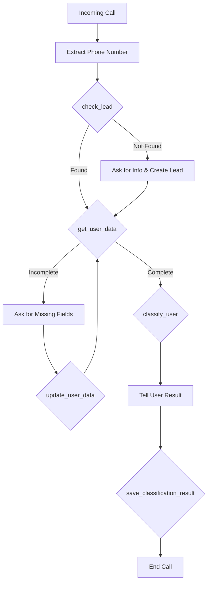

# VAPI Voice Agent with Mock CRM Integration

A comprehensive voice agent system built with VAPI that integrates with mock CRM servers to handle inbound calls, collect user information, and classify users based on bio and genetic data.

## 🏗️ Architecture

The system consists of 4 main components:

1. **Lead CRM Server** (Port 3001) - Manages lead information and phone number lookup
2. **User Data CRM Server** (Port 3002) - Stores and updates user bio/genetic data
3. **Classification CRM Server** (Port 3003) - Classifies users as ACCEPTABLE/NOT_ACCEPTABLE
4. **VAPI Tool Handler** (Port 3000) - Webhook endpoint for VAPI tool calls

## 📁 Project Structure

```
homework2/
├── src/
│   ├── config/
│   │   ├── logger.ts              # Pino logger configuration
│   │   └── constants.ts           # Application constants
│   ├── types/
│   │   ├── lead.types.ts          # Lead type definitions
│   │   ├── userData.types.ts      # User data type definitions
│   │   ├── classification.types.ts # Classification type definitions
│   │   └── vapi.types.ts          # VAPI webhook type definitions
│   ├── utils/
│   │   └── phoneNumber.util.ts    # Phone number utilities
│   ├── data/
│   │   ├── leads.data.ts          # Mock lead data
│   │   ├── userData.data.ts       # Mock user data
│   │   └── classifications.data.ts # Classification storage
│   ├── services/
│   │   └── vapi.service.ts        # CRM API service layer
│   ├── mock-servers/
│   │   ├── leadCrm.server.ts      # Lead CRM API
│   │   ├── userDataCrm.server.ts  # User Data CRM API
│   │   └── classificationCrm.server.ts # Classification CRM API
│   └── vapi/
│       └── toolHandler.server.ts  # VAPI webhook handler
├── .env.example                    # Environment variables template
├── package.json
├── tsconfig.json
└── README.md
```

## 🚀 Quick Start

### Prerequisites

- Node.js (v18 or higher)
- npm or yarn
- VAPI account (get one at https://vapi.ai)

### Installation

1. **Clone and navigate to the project:**
   ```bash
   cd homework2
   ```

2. **Install dependencies:**
   ```bash
   npm install
   ```

3. **Set up environment variables:**
   ```bash
   # Copy the example env file
   cp .env.example .env

   # Edit .env and add your VAPI token
   # Get your token from https://dashboard.vapi.ai
   ```

4. **Run all servers:**
   ```bash
   npm run dev:all
   ```

   This will start all 4 servers concurrently:
   - VAPI Tool Handler: http://localhost:3000
   - Lead CRM: http://localhost:3001
   - User Data CRM: http://localhost:3002
   - Classification CRM: http://localhost:3003

### Running Individual Servers

You can also run servers individually for testing:

```bash
npm run dev:lead-crm           # Lead CRM only
npm run dev:userdata-crm       # User Data CRM only
npm run dev:classification-crm # Classification CRM only
npm run dev:vapi-handler       # VAPI handler only
```

## 🔧 VAPI Configuration

### Step 1: Expose Your Local Server (Development)

For local testing, you need to expose your local server to the internet using ngrok or similar:

```bash
# Install ngrok if you haven't
npm install -g ngrok

# Expose port 3000
ngrok http 3000
```

Copy the HTTPS URL (e.g., `https://abc123.ngrok.io`)

### Step 2: Get Tool Definitions

Visit http://localhost:3000/api/vapi/tools to see the complete tool definitions for VAPI.

### Step 3: Configure VAPI Assistant

1. **Create a new Assistant** in the VAPI Dashboard (https://dashboard.vapi.ai)

2. **Add the following tools** to your assistant (copy from `/api/vapi/tools` endpoint):

   - `check_lead` - Check if caller is in leads database
   - `get_user_data` - Retrieve user bio/genetic data
   - `update_user_data` - Update missing user information
   - `classify_user` - Classify user as ACCEPTABLE/NOT_ACCEPTABLE
   - `save_classification_result` - Save classification result

3. **Configure Server URL** for each tool:
   ```
   https://your-ngrok-url.ngrok.io/api/vapi/tool-calls
   ```

4. **Set up the Assistant Prompt:**

   ```
   You are a helpful medical screening assistant. Your job is to collect user information and determine their eligibility.

   IMPORTANT: The caller's phone number is available as {{customer.number}}.

   Follow this flow:
   1. Greet the caller warmly
   2. Use check_lead tool with {{customer.number}} to see if they're in our system
   3. Use get_user_data tool to retrieve their information
   4. If data is incomplete, ask for missing information:
      - Age
      - Gender
      - Height and weight
      - Medical history
      - Allergies
      - Blood type
      - Family medical history
   5. Use update_user_data tool to save any information you collect
   6. When all data is complete, use classify_user tool
   7. Tell the user their classification result in a friendly, professional way
   8. Use save_classification_result tool to record the final result
   9. Thank the caller and end the call

   Be conversational, empathetic, and professional. Don't overwhelm the user with too many questions at once.
   ```

5. **Set up Phone Number:**
   - Get a phone number in VAPI dashboard
   - Assign your assistant to this number

### Step 4: Test Your System

Call the VAPI phone number and the flow will execute automatically!

## 📊 Call Flow



## 🧪 Testing the APIs

### Test Lead CRM

```bash
# Get all leads
curl http://localhost:3001/api/leads

# Look up a specific lead
curl http://localhost:3001/api/leads/+12025551001
```

### Test User Data CRM

```bash
# Get all users
curl http://localhost:3002/api/users

# Get specific user data
curl http://localhost:3002/api/users/+12025551001

# Update user data
curl -X PUT http://localhost:3002/api/users/+12025551003 \
  -H "Content-Type: application/json" \
  -d '{"bioData": {"height": 175, "weight": 70}}'
```

### Test Classification CRM

```bash
# Get all classifications
curl http://localhost:3003/api/classifications

# Classify a user (requires complete data)
curl -X POST http://localhost:3003/api/classify \
  -H "Content-Type: application/json" \
  -d @sample-user-data.json
```

### Test VAPI Tool Handler

```bash
# View tool definitions
curl http://localhost:3000/api/vapi/tools

# Test tool call (simulating VAPI)
curl -X POST http://localhost:3000/api/vapi/tool-calls \
  -H "Content-Type: application/json" \
  -d '{
    "message": {
      "toolCalls": [{
        "id": "test-123",
        "type": "function",
        "function": {
          "name": "check_lead",
          "arguments": "{\"phoneNumber\": \"+12025551001\"}"
        }
      }]
    },
    "call": {
      "id": "test-call-123",
      "customer": {
        "number": "+12025551001"
      }
    }
  }'
```

## 📝 Sample Data

### Sample Leads (Port 3001)

The system comes with 8 pre-configured leads:

- `+12025551001` - John Smith (complete data)
- `+12025551002` - Sarah Johnson (complete data)
- `+12025551003` - Michael Chen (incomplete data - missing height, weight, allergies, blood type)
- `+12025551004` - Emily Davis (incomplete data - missing weight, family history)
- `+12025551005` - David Wilson (complete data)
- `+12025551006` - Lisa Anderson (very incomplete data)
- `+12025551007` - James Martinez
- `+12025551008` - Jennifer Taylor

### Classification Criteria

Users are classified based on:

- **Age**: 18-65 preferred range
- **Medical History**: Fewer conditions = better score
- **Genetic Conditions**: Affects score negatively
- **Family History**: Hereditary risks considered

**Classification Score:**
- 60+ = ACCEPTABLE
- Below 60 = NOT_ACCEPTABLE

## 🔍 Logging

The system uses Pino for high-performance structured logging.

**Log Levels:**
- `debug` - Detailed function execution
- `info` - Successful operations
- `warn` - Missing data, non-critical issues
- `error` - API failures, exceptions

**View Logs:**
All servers output detailed logs to the console. Each request includes:
- Request ID
- Call ID (for VAPI calls)
- Phone number (masked for privacy)
- Tool names and arguments
- Execution duration
- Results

## 🔒 Security Notes

- Phone numbers are masked in logs (last 4 digits only)
- Helmet.js enabled for security headers
- CORS enabled for development (restrict in production)
- Input validation on all endpoints
- Error messages don't expose internal details

## 🏗️ Development

### Build for Production

```bash
npm run build
```

### Start Production Server

```bash
npm start
```

### Code Structure Principles

- **Modular**: Each CRM is independent
- **Reusable**: Shared utilities and types
- **Type-safe**: Full TypeScript coverage
- **Logged**: Comprehensive logging throughout
- **Documented**: Comments explain business logic

## 🐛 Troubleshooting

### Servers won't start

- Check if ports 3000-3003 are available
- Ensure Node.js version is 18+
- Delete `node_modules` and reinstall

### VAPI can't reach webhook

- Verify ngrok is running
- Check VAPI tool configuration has correct URL
- Ensure webhook URL uses HTTPS (not HTTP)

### Classification fails

- Ensure user data is complete
- Check logs for specific error messages
- Verify all required fields are present

### Tool calls not working

- Check VAPI dashboard tool definitions
- Verify server URL matches ngrok URL
- Check logs for incoming requests

## 📚 Additional Resources

- [VAPI Documentation](https://docs.vapi.ai)
- [VAPI Tool Calling Guide](https://docs.vapi.ai/tools)
- [Pino Logger Docs](https://getpino.io)
- [Express.js Guide](https://expressjs.com)

## 🤝 Contributing

This is a demo project. Feel free to extend it with:

- Real database integration (PostgreSQL, MongoDB)
- Authentication and authorization
- More sophisticated classification algorithms
- SMS notifications
- Email reports
- Dashboard UI
- Unit and integration tests

## 📄 License

MIT

---

**Built with ❤️ using TypeScript, Express, and VAPI**

For questions or issues, check the logs first - they're very detailed!
